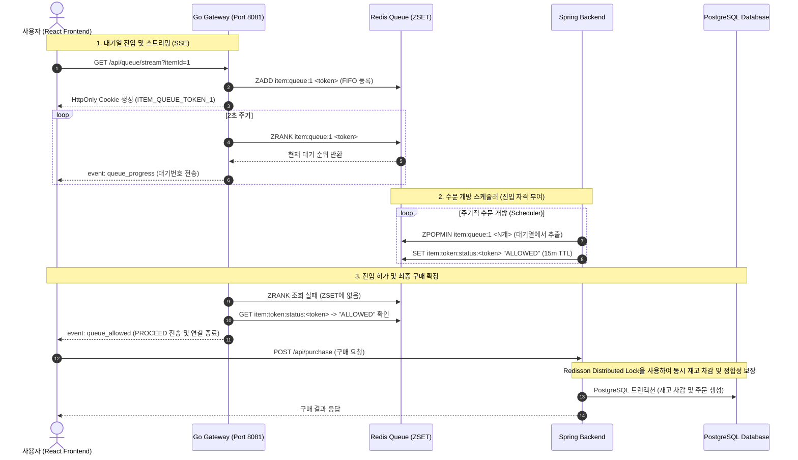

# 🛒 대규모 선착순 트래픽 제어를 위한 가상 대기열 기반 구매 시스템

본 프로젝트는 한정 수량 아이템 구매 오픈, 이벤트 선착순 등 정각에 다수의 사용자가 일시에 몰리는 **Flash Crowd(일시 집중 트래픽)** 환경에서 백엔드 서버와 데이터베이스를 안전하게 보호하고, 정밀한 선착순 진입을 보장하기 위해 설계된 **가상 대기열(Virtual Waiting Room) 아키텍처**입니다.

초경량 비동기 처리에 특화된 **Go 게이트웨이**와 **Redis** 대기열을 결합하여 폭발적인 트래픽을 흡수하고, **Spring Boot 비즈니스 서버**가 최종 구매 처리를, **React 프론트엔드**가 실시간 대기열 UI를 담당하는 **3계층 아키텍처**로 구성됩니다.

---

## 📐 System Architecture Diagram



---

## 🚀 Key Architectural Highlights

1. **비로그인 익명 토큰 발급 및 중복 진입 방지**
    - 로그인 서버의 병목을 막기 위해 최초 진입 시 로그인 없이 `UUIDv4` 기반 익명 대기열 토큰을 발급합니다.
    - 발급된 토큰은 `HttpOnly` 쿠키(`ITEM_QUEUE_TOKEN_{itemId}`)로 관리되어 브라우저 다중 탭(새로고침) 진입 시 동일 토큰을 재사용하므로 어뷰징 및 중복 점유를 원천 차단합니다.

2. **Go 기반의 초경량 방파제 (VWR - Virtual Waiting Room)**
    - 대기열 진입 및 2초 주기 대기 번호 스트리밍(SSE)을 오직 Go 서버가 전담합니다.
    - 고루틴(Goroutine)의 극단적인 메모리 효율성(커넥션당 약 2KB)을 활용하여 최소 사양에서도 수많은 커넥션을 안정적으로 유지합니다.
    - `:8081` 포트에서 단일 바이너리로 구동됩니다.

3. **2단계 자격 관리 (ZSET & Status TTL) - *구현 예정***
    - 대기열 정체를 막기 위해 백엔드 처리 완료 시점이 아닌 **백엔드 진입 시점**에 Redis `ZSET`에서 유저를 제거(ZPOPMIN)하고, 임시 진입 자격인 `ALLOWED` 상태로 변경합니다.
    - 사용자가 주문 양식을 입력하는 시간(Think Time) 동안 메인 대기열은 정체되지 않고 숨을 고를 수 있으며, 발급된 진입 자격은 15분의 짧은 TTL을 적용하여 매크로 및 우회 진입을 방지합니다.

4. **Java 가상 스레드 & Redisson 분산 락 - *구현 예정***
    - Spring Boot 환경에서 Java Virtual Threads를 활성화하여 동시 다발적인 I/O 처리 시 스레드 고갈 문제를 해결합니다.
    - `Redisson` 분산 락을 통해 멀티 인스턴스 환경에서도 안전하게 재고 데이터 정합성을 지키며 데이터베이스에 트랜잭션을 적용합니다.

---

## 🛠 Tech Stack & Versions

### ✅ 구현 완료
- **Go 게이트웨이**
  - Language/Runtime: Go 1.26.4
  - In-Memory Queue: Redis (go-redis/v9)
  - `github.com/google/uuid v1.6.0` — UUIDv4 토큰 생성
  - `github.com/redis/go-redis/v9 v9.20.1` — Redis 클라이언트
  - `github.com/joho/godotenv v1.5.1` — 환경 변수 로드

### 🔜 추가 예정
- **Spring 비즈니스 서버**
  - Framework: Spring Boot 4+ / Java 25+ (가상 스레드 활성화)
  - Database: PostgreSQL (18+ / alpine)
  - Redis Client: Redisson (분산 락 제어)
- **React 프론트엔드**
  - Library/Framework: React, Vite, TypeScript
  - Styling: TailwindCSS 혹은 Vanilla CSS
  - API Connection: EventSource (SSE 수신)

---

## 📂 Directory Structure

```text
whosbuying/
├── gateway/                       # ✅ [앞단] Go 게이트웨이 — 익명 토큰 발급 & SSE 대기열 스트리밍
│   ├── cmd/
│   │   └── main.go                # 진입점: Redis 연결, 라우터 설정, 서버 구동 (포트 8081)
│   └── internal/
│       └── queue/
│           ├── handler.go         # HTTP 핸들러: SSE 스트리밍, 쿠키 토큰 관리
│           └── service.go         # 비즈니스 로직: 토큰 발급, 대기 순번 조회 (Redis ZSET)
├── backend/                       # 🔜 [뒷단] Spring Boot 비즈니스 서버 (추가 예정)
├── frontend/                      # 🔜 React 프론트엔드 (추가 예정)
├── .env                           # 환경 변수 (REDIS_URL 또는 REDIS_ADDR/REDIS_PASSWORD)
└── .gitignore
```

---

## ⚙️ Configuration

환경 변수는 `.env` 파일 또는 시스템 환경 변수로 주입합니다.

| 변수 | 설명 | 예시 |
|---|---|---|
| `REDIS_URL` | Redis 접속 URL (비밀번호 및 호스트 정보 포함) | `redis://:password@localhost:6379` |
| `BACKEND_PORT` | Spring Boot 백엔드 서버 구동 포트 (기본값: 8080) | `8080` |
| `GATEWAY_PORT` | Go 게이트웨이 서버 구동 포트 (기본값: 8081) | `8081` |

---

## 🚀 Getting Started

```bash
# 1. 의존성 설치
cd gateway
go mod tidy

# 2. 환경 변수 설정 (.env 파일 생성)
echo "REDIS_URL=redis://localhost:6379" > ../.env

# 3. 서버 실행
go run ./cmd/main.go
```

서버가 `http://localhost:8081` 에서 구동됩니다.

**대기열 진입 API:**
```
GET /api/queue/stream?itemId={아이템_ID}
```
응답은 SSE(text/event-stream) 형식이며, 2초마다 아래 이벤트를 수신합니다.

| 이벤트 | 데이터 | 의미 |
|---|---|---|
| `queue_progress` | 현재 대기 번호 (1-indexed) | 아직 대기 중 |
| `queue_allowed` | `PROCEED` | 진입 허가 완료 |

---

## 🗺 Roadmap

- [x] Go 게이트웨이 — 익명 토큰 발급, Redis ZSET 대기열, SSE 순번 스트리밍
- [ ] Spring 비즈니스 서버 — 수문 개방 스케줄러, 재고 차감, 구매 확정 API
- [ ] React 프론트엔드 — 대기열 화면, SSE 수신 및 구매 폼 UI
